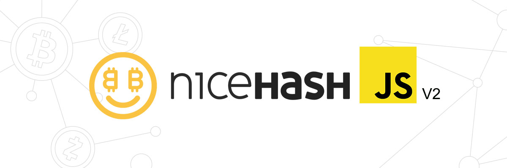

# NiceHashJS

The javascript library for Nicehash API v2.

## Installation

    npm install --save nicehashjs2

## Usage

    const NicehashJS = require('nicehashjs2');
    const nhClient = new NicehashJS({
        apiKey: <myApiKey>, 
        apiSecret: <myApiSecret>
    });

## Contribution

All PRs are welcome!